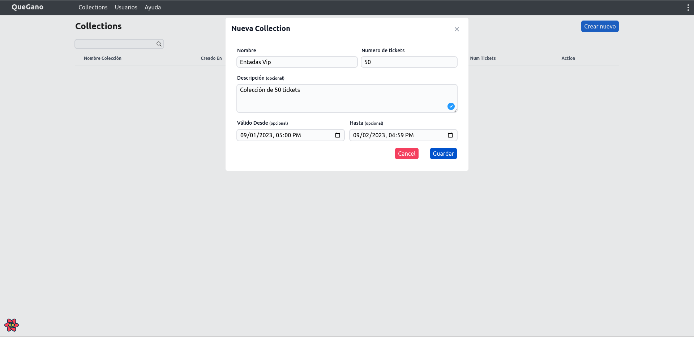
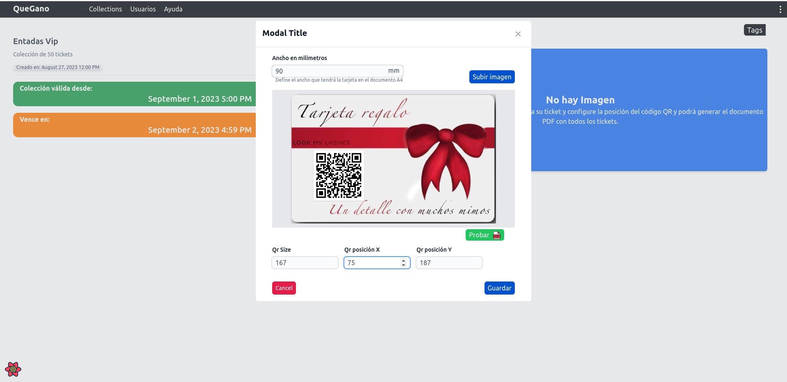
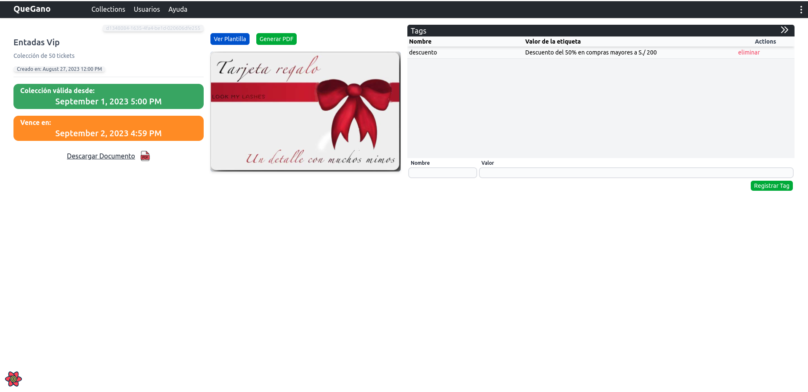
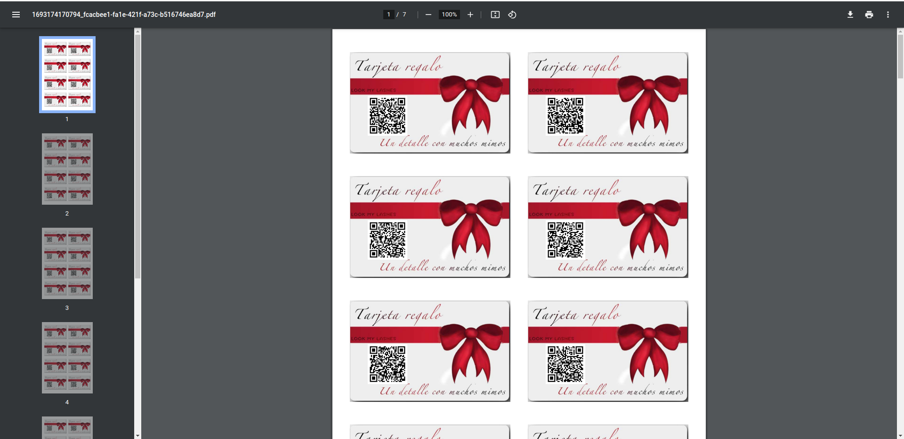
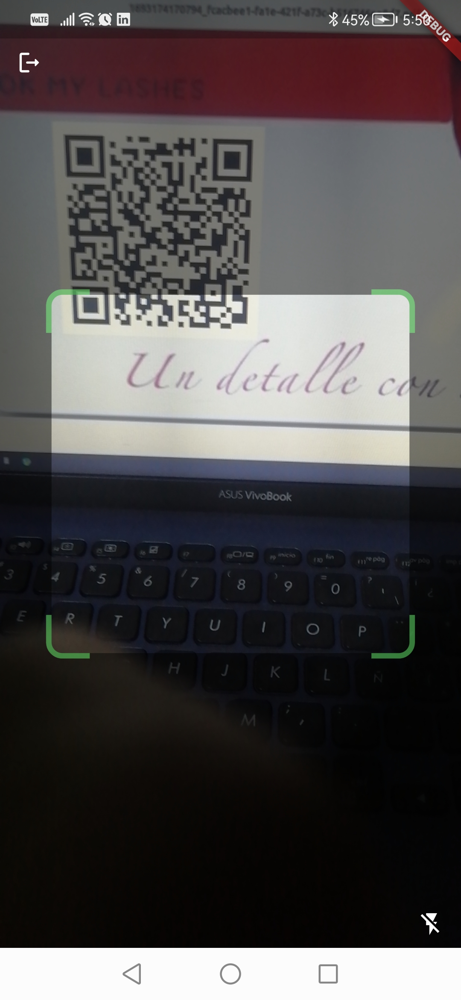

## GOQRS

Es un proyecto desarrollado para generar documentos PDF A4 con tarjetas a las cuales se les agrega un identificar QR único permitiendo utilizar estas tarjetas como vales de consumo, entradas a eventos, identificadores, etc..

Características:
    - Como principal característica esta la posibilidad de subir la plantilla de la tarjeta como imagen PNG, definir el ancho que esta tendría sobre el documento A4, definir la ubicación y dimenciones que tendría el código QR, y el numero de targetas que vamos a generar.

    - Permite crear colecciones, la cual representa un grupo de tarjetas, las cuales pueden pertenecer a un evento o campaña.

- Vista para registro de colecciones de tarjeta

- Configuración de plantilla y ubicación de código QR

- Vista de colección y las etiquetas asociadas a las etiquetas, las cuales serán útiles al escanear la tarjeta desde el aplicativo móvil

- Documento con todas las targetas generadas

### App Mobile

Estas tarjetas son lectura das por un aplicativo móvil en donde puede ser validadas.

